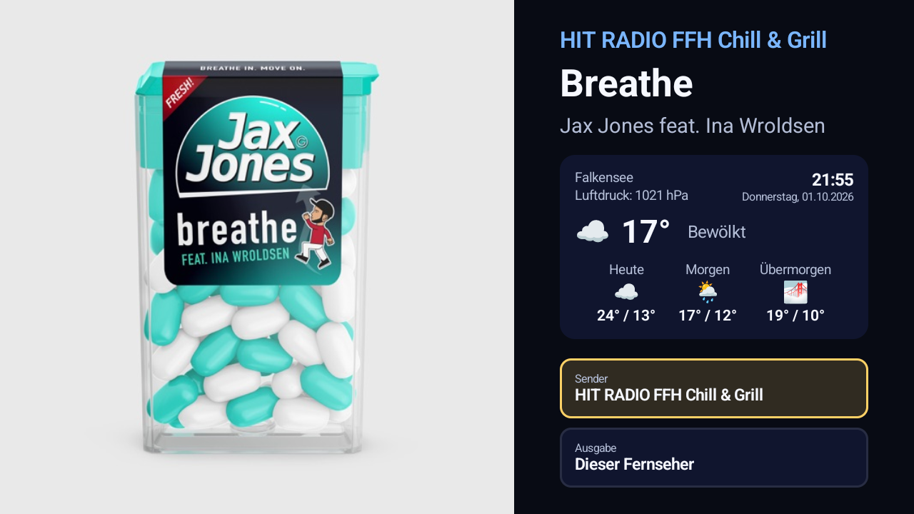
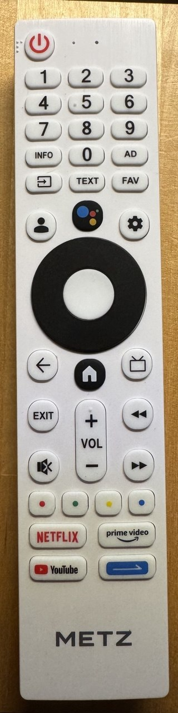

# GoogleTV Music Player

Standalone Android TV / Google TV app that reproduces the radio-display
experience of the companion Raspberry Pi project
([onradio-cover-bridge](https://github.com/TBR-BRD/onradio-cover-bridge))
**without a running Pi**: album cover on the left, station name / title /
artist / clock / weather on the right, stations selectable by remote (D-pad),
playback directly on the TV itself.



## Download / Installation

**[⬇ Download Radioplayer.apk](https://github.com/TBR-BRD/googletv-musicplayer/releases/latest/download/Radioplayer.apk)**
(latest build, debug-signed)

How to install it on a Google TV / Android TV device without a dev machine
or the Play Store listing:

1. Install the **"Downloader"** app from the Play Store on the TV
2. Enter the link above in Downloader (copy/paste it)
3. Let it download and install - allow "install from unknown sources" if
   prompted

All releases with version history: [Releases page](https://github.com/TBR-BRD/googletv-musicplayer/releases)

This is **Phase 1** of a multi-stage plan:

| Phase | Scope | Status |
|---|---|---|
| 1 | Station list, metadata, cover art, weather, playback on the TV itself | **done** |
| 2 | Google Cast (throw to Chromecast-capable devices) | **done** |
| 3 | UPnP/DLNA (Sonos, Denon) | **done** (Sonos; some AV receivers reject arbitrary stream URLs - see below) |
| 4 | AirPlay (RAOP) | **implemented, not yet working against the two real receivers tested** - see below |

Output device (this TV's own speaker, a Google Cast device, or a UPnP/DLNA
renderer) is switchable at runtime from the "Ausgabe" picker next to the
station picker - see [Controls](#controls) below. Note that UPnP renderers
vary widely in how well they actually support arbitrary internet radio
URLs (Sonos: yes; some AV receivers only support their own local DLNA
media server content and will reject the stream), and Google Cast requires
the TV's own Google Play Services to include the Cast framework module -
not guaranteed on non-Google-TV-certified licensed Android TV hardware.

## AirPlay (RAOP) - implemented, but unproven on real hardware

The Pi project uses `pyatv` for AirPlay, a Python-specific library with no
Android/Kotlin equivalent, so this app's AirPlay sender (package
`airplay/`) was written from scratch against the classic AirPlay 1 / RAOP
protocol: an RTSP handshake (`OPTIONS`/`ANNOUNCE`/`SETUP`/`RECORD`/
`SET_PARAMETER`/`TEARDOWN`), RTP audio streaming encoded as real Apple
Lossless (via `app/src/main/cpp/alac/` - Apple's own open-source ALAC
encoder, vendored and built through the NDK, wrapped by a small JNI layer
in `AlacEncoder.kt`/`alac_jni.cpp`), RSA+AES-128-CBC payload encryption
(`RaopCrypto.kt` - the RSA key is the long-published, non-secret RAOP
public key every open-source AirPlay implementation embeds), and the
control-channel packet retransmission real receivers request
(`RaopClient.handleControlPacket`/`startControlListener`). Devices are
discovered the same way as Cast/UPnP, via plain `NsdManager` (`_raop._tcp`).

**Status: builds and runs a complete, protocol-correct session against
real hardware, but produces no audible output on either receiver tested:**

- **Denon AVR-X2000**: accepts the full handshake and a continuous,
  correctly-encoded and -encrypted RTP stream with zero errors at any
  layer, yet never produces sound. This was debugged through four
  successive implementations (raw PCM, real ALAC, ALAC+encryption,
  ALAC+encryption+retransmission) - all behave identically from this
  app's point of view, which suggests a remaining gap this app can't
  diagnose without comparing against a packet capture of a genuine Apple
  sender talking to the same device (an authentication/pairing step this
  implementation doesn't perform is the leading suspect).
- **Samsung Music Frame**: rejects the `ANNOUNCE` step outright with
  `403 Forbidden`, before any audio data is ever sent - likely a stricter
  requirement (possibly mandatory encryption terms this implementation
  doesn't meet, or additional AirPlay 2 negotiation it expects
  unconditionally).

Both of these devices work fine as outputs through this app via their
*other* protocol (Google Cast for the Music Frame, UPnP is untested on it;
UPnP itself fails on the Denon for an unrelated reason - see the phase 3
note above). Anyone who wants AirPlay specifically still needs the Pi (or
another genuine AirPlay source) for now. The code is left in rather than
removed since the protocol work (handshake, ALAC, crypto, retransmission)
is correct and reusable - it may just need a real device that's more
lenient, or a further authentication step this app doesn't yet implement.

## Where the station list comes from

Two layers, for both freshness and offline resilience:

1. **`app/src/main/res/raw/stations.json`** - a bundled snapshot (all 253
   stations as of the last build), used immediately on app start so the app
   works right away and even fully offline.
2. **[radiostations](https://github.com/TBR-BRD/radiostations)** - a
   dedicated repo that a scheduled GitHub Action keeps in sync with the Pi
   project's `app/stations.py` automatically (monthly, or on demand). The
   app fetches this in the background on every launch and switches to it
   once it arrives, so new or changed stations show up **without an app
   update** - only falling back to the bundled snapshot if that fetch fails
   (no network, GitHub unreachable, ...).

See `StationRepository.kt` for the fetch-with-fallback logic.

To regenerate the bundled snapshot manually (e.g. after a Gradle dependency
bump that needs a rebuild anyway), run this from a clone of
`onradio-cover-bridge` (adjust `OUTPUT` to point into a clone of this
repo) - or just use [radiostations/generate.py](https://github.com/TBR-BRD/radiostations/blob/main/generate.py)
directly, which is the same script:

```bash
python3 - <<'EOF'
import dataclasses, sys, json
_orig = dataclasses.dataclass
def patched(*a, **kw):
    kw.pop("slots", None)
    return _orig(*a, **kw)
dataclasses.dataclass = patched  # only needed on Python < 3.10

sys.path.insert(0, ".")
from app.stations import STATIONS

def group_for(station_id):
    if station_id.startswith("on-"): return "ON Radio"
    if station_id.startswith("80s80s-"): return "80s80s"
    if station_id.startswith("sunshine-live"): return "Sunshine Live"
    if station_id.startswith("radio-bob-"): return "RADIO BOB!"
    if station_id.startswith("ffh-"): return "HIT RADIO FFH"
    if station_id.startswith("absolut-"): return "Absolut Radio"
    if station_id.startswith("energy-"): return "ENERGY"
    return "Other stations"

out = []
for s in STATIONS:
    d = dataclasses.asdict(s)
    out.append({
        "id": d["id"], "name": d["name"], "group": group_for(d["id"]),
        "homepageUrl": d["homepage_url"],
        "audioUrl": d["audio_url"], "audioMode": d["audio_mode"],
        "metadataUrl": d["metadata_url"], "metadataMode": d["metadata_mode"],
        "metadataStationLabel": d["metadata_station_label"],
        "metadataStationAliases": list(d["metadata_station_aliases"]),
        "metadataStationId": d["metadata_station_id"],
    })

OUTPUT = "../googletv-musicplayer/app/src/main/res/raw/stations.json"
with open(OUTPUT, "w", encoding="utf-8") as f:
    json.dump(out, f, ensure_ascii=False, indent=2)
EOF
```

## Metadata coverage (honest status)

Of the 253 stations:

- **193** use `icy_stream` (title read directly from the audio stream via the ICY protocol) - **fully implemented**
- **18** use `0nradio_json` (the ON Radio family's own JSON API) - **fully implemented**
- **42** use `80s80s_api` (80s80s's own shared now-playing endpoint, matched by each station's `metadataStationId`) - **fully implemented**, including the cover art it hands back directly

That's **100% of stations with real title/artist info** (and, for the
80s80s ones, cover art straight from the API instead of an iTunes guess).

## Cover art

**iTunes Search API** only (public, no key needed), simplest match
selection. The MusicBrainz/Cover Art Archive and Amazon fallbacks from the
Pi project's `app/cover_provider.py` are not (yet) ported - cover hit rate
is somewhat lower than on the Pi side, but sufficient for most current/
well-known tracks.

## Building

1. Open this folder in a current version of Android Studio, let Gradle sync.
2. Connect a Google TV device over ADB (`adb connect <tv-ip>:5555`, enable
   ADB debugging in the Google TV developer settings) or create an Android
   TV emulator in Android Studio.
3. Hit "Run" - the app then also shows up as a regular app tile on the
   Google TV home screen (the Leanback launcher category is set).

### Signing

Releases (from v0.4.0) are signed with a dedicated release key, so every
new version installs over the previous one without losing favorites or
settings. **Upgrading from v0.3.0 or older needs a one-time uninstall**
first - those were signed with a per-machine debug key.

- Release APKs are built by GitHub Actions
  ([`release.yml`](.github/workflows/release.yml)) when a `v*` tag is
  pushed, and attached to that release as `Radioplayer.apk`. The keystore
  lives in the repository secrets `RADIOPLAYER_KEYSTORE_BASE64`,
  `RADIOPLAYER_KEYSTORE_PASSWORD` and `RADIOPLAYER_KEY_ALIAS`.
- Local builds use the same key if `~/.gradle/gradle.properties` defines
  `RADIOPLAYER_KEYSTORE` (path to the .jks), `RADIOPLAYER_KEYSTORE_PASSWORD`
  and `RADIOPLAYER_KEY_ALIAS` - debug builds included, so a locally built
  APK can update an installed release. Without them the build falls back
  to the machine's own debug key.
- The keystore is not in this repository. Losing it means no further
  update can be installed over an existing installation.

## Controls



- **OK** on the "Station" button opens the station picker
- The picker is **two-pane**: categories on the left (ON Radio, RADIO BOB!,
  ENERGY, HIT RADIO FFH, Absolut Radio, 80s80s, Sunshine Live, Other
  stations), stations of the highlighted category on the right
- **◀ / ▶**: switch between the category and station columns
- **▲ / ▼**: navigate within the active column
- **OK** on a station: play it and close the picker
- **Long-press OK** on a station: toggle it as a favorite (★), without
  switching playback
- **Back**: close the picker without changing anything
- A **"★ Favorites"** category automatically appears at the top once at
  least one station is favorited
- The last station picked within each category is remembered locally on
  the device (survives app restarts) - reopening a category jumps back to
  it instead of always starting at the first entry
- The last-played station resumes automatically on the next app launch
- Metadata/cover refresh every 15 seconds, weather every 10 minutes
- **OK** on the "Ausgabe" button opens the output picker: this TV's own
  speaker, or any discovered Google Cast / UPnP (Sonos, Denon, ...) device
  on the LAN - **◀ / ▶** on a selected WLAN speaker's row adjusts its
  volume (the remote's physical volume keys only control the TV's own
  volume - on-device testing found they never reach Android as a key event
  at all on at least one TV model, so there's no way to redirect them)
- Remote shortcuts, from anywhere in the app:
  - **Red / Green**: active WLAN speaker's volume down / up (2 % per press,
    repeats while held) - no effect while playing on the TV's own speaker
  - **⏪ / ⏩** (rewind / fast-forward): previous / next favorite, in the
    order of the "★ Favorites" category, wrapping around
  - A short on-screen notice shows the new volume or station
  - Tested with the Metz Google TV remote pictured on the right; other
    remotes work as long as they send the standard Android key codes
    (`PROG_RED`/`PROG_GREEN`, `MEDIA_REWIND`/`MEDIA_FAST_FORWARD`)
- Playback stops automatically when the TV's screen turns off (standby),
  on whichever output is active

<br clear="right">

## Changing the weather location

Configurable in-app: press OK on the weather panel to open a dialog and
type a new city name (stored on-device, defaults to "Falkensee"). The
display always shows the geocoding API's canonical spelling, regardless of
how it was typed.
